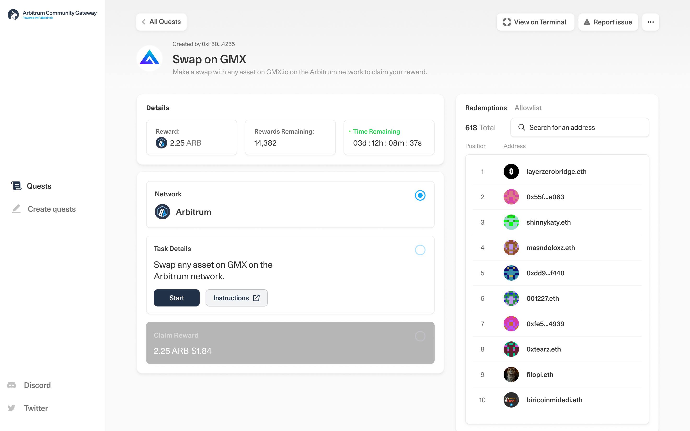

# Quest Gateway
Accessible and customizable gateway that you can deploy to your community. Free and Open Source. **Use this to deploy your custom quest gateway and start earning Quest Protocol rewards**.

## Get Started

There are two ways to work with this app:

1. **Fork and customize**: You can fork this repository and customize the code to suit your needs. This gives you full control over the functionality and appearance of the app.

2. **Deploy directly to your host**: For a quick, code-free deployment, you can use the environment variables provided to customize the appearance and quest filters. Deploy to Vercel in one click using the `Deploy` button above. View `.env.template` for the full list of configurable properties.

## Environment Settings
To customize and configure the app, set the following environment variables:

### 
Required 

Variable | Description
--- | ---
`NEXT_PUBLIC_ALCHEMY_API_KEY` | Your Alchemy API key, used for Connectkit.
`NEXT_PUBLIC_WALLETCONNECT_PROJECT_ID` | Your WalletConnect project ID, used for Connectkit.
`NEXT_PUBLIC_API_URL` | https://public-api.rabbithole.gg/

### Theming
Variable | Description
--- | ---
`THEME_BRAND_PRIMARY` | The primary color for the theme. Provide a hex color value.
`NEXT_PUBLIC_THEME_BRAND_LOGO_URI` | The image source to use for sidebar and mobile header logo.
`NEXT_PUBLIC_THEME_BRAND_OG_IMAGE_URI` | The image source to use for the OG image.

### Quest settings 
Variable | Description
--- | ---
`NEXT_PUBLIC_REFERRAL_REWARDS_ADDRESS` | Quest Protocol referral rewards recipient.
`NEXT_PUBLIC_TASK_NETWORK` | The network identifier filter for tasks.
`NEXT_PUBLIC_REWARD_NETWORK` | The network identifier filter for rewards.

### Quest Filtering 
To filter quests based on a specific task and/or reward network, set the appropriate environment variable with one of the following options:

Option | Description
--- | ---
`eth-mainnet` | Ethereum mainnet.
`opt-mainnet` | Optimism mainnet.
`optimism` | Optimism network.
`arbitrum` | Arbitrum network.
`arb-mainnet` | Arbitrum mainnet.
`polygon` | Polygon network.
`polygon-mainnet` | Polygon mainnet.

## Documentation

Visit https://help.rabbithole.gg/quest-protocol/introduction-to-quest-protocol to view the documentation.

## Contributing

Please read the [contributing guide](/CONTRIBUTING.md).

## License

Licensed under the [MIT license](https://github.com/rabbitholegg/gateway/blob/main/LICENSE.md).
